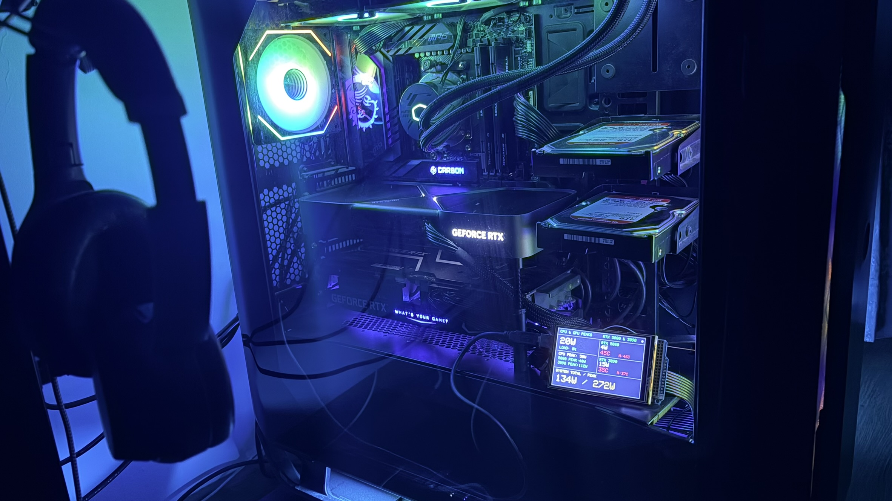
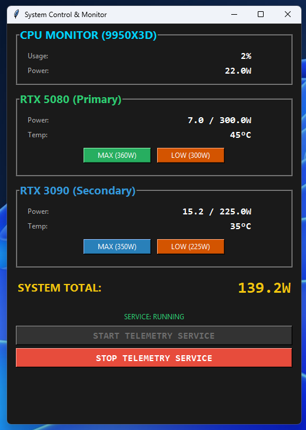
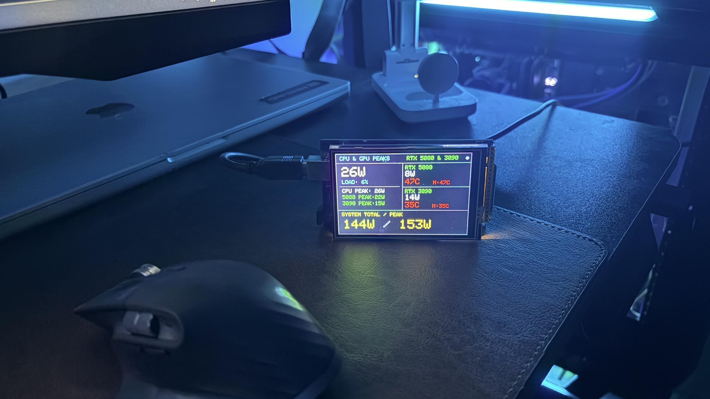
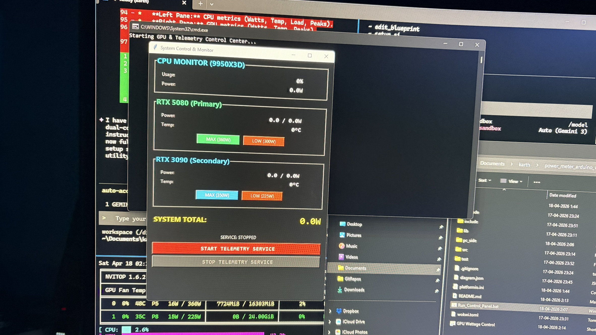
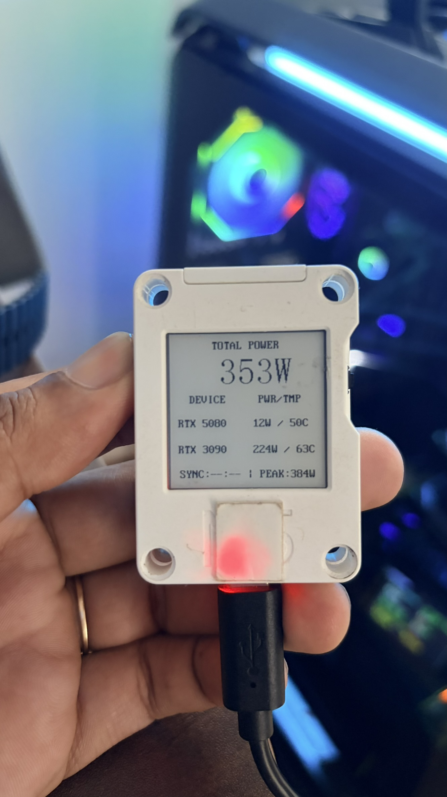

## 🎯 Who is this for?

1.  **Hardware Enthusiasts & Modders:** For those who want a dedicated real-time hardware dashboard (CPU/GPU load, temps, power) visible through their PC cabinet's glass side panel.
    *   **Pre-requisites:** Arduino Uno or Mega + 3.5" (or larger) TFT LCD Shield.
2.  **Power-Conscious Users (Dual GPU/Small Circuits):** For users running high-performance hardware (like Dual RTX 3090/5080) on standard residential circuits (e.g., 6A sockets in India) who need to monitor real-time wattage to prevent tripping breakers or damaging electrical infrastructure.


## ⚠️ Safety & Power Management (Dual GPU Context)

Running a dual GPU setup with a **RTX 3090** and **RTX 5080** on a standard **1000W PSU** presents significant electrical challenges, particularly during long-running Machine Learning tasks (LoRA training, LLM inference).

### The Challenge
1.  **Transient Power Spikes:** High-end GPUs are notorious for "micro-spikes" (millisecond-duration transients) that can exceed their rated TDP significantly. Combined, these spikes can overwhelm a 1000W PSU's OCP (Over-Current Protection), leading to sudden system shutdowns or hardware stress.
2.  **Infrastructure Limits (India):** In many Indian residential settings, standard power sockets are rated for **6A**. At 230V, while the theoretical limit is ~1380W, sustained high-wattage draw (especially on shared circuits with aging wiring) risks overheating sockets or tripping breakers. 
3.  **Economic Constraints:** Upgrading to high-tier 1200W-1600W PSUs involves exponentially rising costs. Additionally, many of these PSUs require 16A industrial-style sockets, which necessitates expensive electrical modifications to the room.

### The Solution
This project provides a software-controlled safety layer:
*   **Active Monitoring:** Real-time visibility into "Actual vs Limit" wattage on both the Arduino and the PC GUI allows you to see exactly how much headroom remains.
*   **Dynamic Capping:** One-click toggles to adjust power limits. The app defaults to **MAX performance (320W for 5080, 250W for 3090)** on startup to ensure a consistent performance baseline, with "LOW" toggles available for long-running thermal-conscious sessions.
*   **Visual Alerts (WLED):** Integration with WLED-enabled devices provides ambient room lighting that changes color based on total system power draw:
    *   **Green:** < 400W (Safe/Idle)
    *   **Yellow:** 400W - 600W (High Load)
    *   **Red:** > 600W (Critical/Peak Zone)
  
# Dead Simple Power & Temp Monitor v2.6

Simple system telemetry suite for Arduino Mega/Uno and Windows. This project provides a real-time hardware dashboard on a 3.5" TFT Shield and a desktop control utility for managing GPU power limits and system stability testing.

## 🖼 Visuals

| Arduino Hardware Dashboard | PC Control Panel |
| :---: | :---: |
|  |  |
|  |  |

| M5 Core Ink Wireless Dashboard |
| :---: |
|  |


## 🏗 Architecture & Summary

The system follows a **Producer-Dual Consumer** model with an integrated **Control Feedback** loop:

1.  **Producer (PowerCheck_Serial.ps1):** A hidden PowerShell service that gathers CPU metrics (WMI) and Dual GPU metrics (Nvidia-SMI), including live power draw, temperatures, and set power limits.
2.  **Transmitter:** 
    *   **Serial (USB):** Sends a 10-value CSV packet to the Arduino every second.
    *   **UDP (Local/Broadcast):** Broadcasts the same packet on port `9999` for the local Python GUI and Web Client.
3.  **Consumer A (Arduino):** Displays a high-density landscape dashboard. Features a **Touch Toggle** to switch between "All Metrics" and a "Big Font Focus Mode".
4.  **Consumer B (Python GUI):** A dark-themed desktop monitor that mirrors the Arduino and provides buttons to dynamically adjust RTX 5080 and RTX 3090 power limits via batch scripts.
5.  **Consumer C (Web Client):** A responsive mobile-friendly dashboard accessible via IP address (e.g., from an iPhone) on port `8000`.


## 📊 Data Flow & Protocol

```text
[ WINDOWS PC ]                                     [ ARDUINO ]
PowerCheck Service  ---( Serial USB )----------->  Dashboard UI
(Producer)          |                              (Consumer A)
      |             |
      |             +---( UDP Port 9999 )-------+
      |                                         |
      v                                         v
[ CONTROL PANEL ] <---( Execute BAT )--- [ PYTHON GUI ]
(Feedback Loop)                          (Consumer B)
```

### CSV Protocol Specification
The system uses a **15-value** floating-point string:
`usage, cpuPwr, cpuTemp, g1Pwr, g1Temp, g1Limit, g2Pwr, g2Temp, g2Limit, sysPwr, peakCpu, peakG1, peakG2, peakSys, time`

| Field | Description | Field | Description |
| :--- | :--- | :--- | :--- |
| `usage` | CPU Load % | `g2Temp` | RTX 3090 Temp (°C) |
| `cpuPwr` | CPU Watts | `g2Limit` | RTX 3090 Power Limit (W) |
| `cpuTemp`| (Reserved) | `sysPwr` | Total System Draw |
| `g1Pwr` | RTX 5080 Watts | `peakCpu` | Session Peak CPU (W) |
| `g1Temp` | RTX 5080 Temp (°C) | `peakG1` | Session Peak G1 (W) |
| `g1Limit`| RTX 5080 Power Limit (W)| `peakG2` | Session Peak G2 (W) |
| `g2Pwr` | RTX 3090 Watts | `peakSys` | Session Peak System (W) |
| `time` | Sync Time (HH:mm) | | |

### 3. Web Client (Mobile/iPhone)
*   Ensure the Telemetry Service is running.
*   Run `Run_Web_Client.bat` from the root folder.
*   The console will display your local IP (e.g., `http://192.168.x.x:8000`).
*   Open this link on your iPhone or any device on the same network.

## 🖥 Features

### Web Dashboard (New)
*   **Mobile Optimized:** Designed specifically for quick viewing on iPhone/Android.
*   **Real-time SSE:** Uses Server-Sent Events for low-latency updates without page refreshes.
*   **Zero-Config:** Automatically detects local IP and displays it for easy connection.
*   **Visual Feedback:** Metrics change color dynamically based on power load.

### Python GUI & Stability Testing
*   **Live Mirror:** Real-time data from the PowerShell service.
*   **Limit Monitoring:** Shows `Actual Watts / Limit Watts` for both GPUs.
*   **Vulkan Memtest:** Quick access to launch `memtest_vulkan.exe` in a dedicated console for GPU memory stress testing.
*   **Silverbench Launch:** One-click button to open Silverbench (browser-based multi-core benchmark) in Microsoft Edge.
*   **Ambient Sync:** Automatically discovers WLED devices via Zeroconf and syncs room lighting to your PC's power consumption.
*   **Background Operation:** The PowerShell window is hidden automatically when started.

### Arduino Dashboard
*   **Standard View:** Parallel columns for CPU and Dual GPU live data + Peak tracking.
*   **Focus View:** Massive font display of Total System Watts and All-time Peak.
*   **Heartbeat:** Green LED in the top right blinks on every successful packet.

## 📂 Project Structure
```text
├── Run_Control_Panel.bat    # Entry point for PC software
├── platformio.ini           # Arduino build config
├── src/
│   ├── arduino_mega/        # Arduino Mega/Uno Display & Touch logic
│   └── m5_core_ink/         # M5 Core Ink Wireless Display logic
├── include/telemetry.h      # Shared C++ parsing logic
└── pc_side/
    ├── control_gui.py       # Python Monitoring App
    ├── PowerCheck_Serial.ps1 # Telemetry Service
    └── *_power_limit.bat    # GPU Control scripts
```

## 📌 Maintenance Tips
*   **Pinning to Taskbar:** Create a shortcut for `Run_Control_Panel.bat`, right-click -> Properties, and change the target to: `cmd /c "PATH_TO_BATCH"`.
*   **Auto-Start:** Add that shortcut to `shell:startup` for monitoring on every boot.
